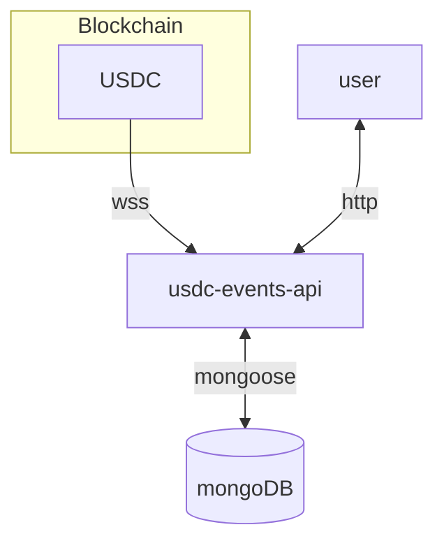

# usdc-events-api

USDC contract events ingestion, storage and access.

## schema

## endpoints

### chain

| type | description | url | return value |
|---|---|---|---|
| GET | chain identifier | `/chain/id`| `{ chainId: "<chainId>" }` | |
| GET | current block number | `/chain/blocknumber` | `{ blockNumber: "<blockNumber>" } ` |
