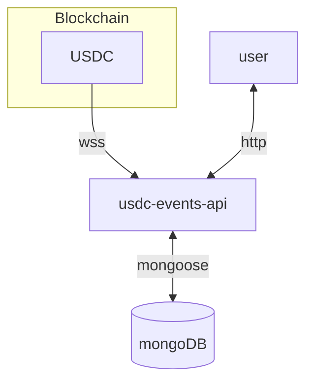

# usdc-events-api

USDC contract events ingestion, storage and access.

## schema

## endpoints

### chain

| type | description | url | return value |
|---|---|---|---|
| GET | chain identifier | `/chain/id` | `{ chainId: {name: "<chainName>", chainId: "<chainId>"}}` | |
| GET | current block number | `/chain/blocknumber` | `{ blockNumber: "<blockNumber>" } ` |

### events/filter

| type | description | url | return value |
|---|---|---|---|
| GET | event by ObjectId | `/events/transfer/:id` | `[{<event>},{<event>}]` |
| GET | filter events | `/events/transfer/filter` | `[{<event>},{<event>}]` |

#### filter options

| field | description | example |
|---|---|---|
| from | transfer event from field | `<url>/events/transfer/filter?from=0x<address>` |
| to | transfer event to field | `<url>/events/transfer/filter?to=0x<address>` |
| initDate | ISO8601 compatible initial time | `<url>/events/transfer/filter?initDate=YYYY-MM-DDT00:00:00.000Z` |
| endDate | ISO8601 compatible final time | `<url>/events/transfer/filter?endDate=YYYY-MM-DDT00:00:00.000Z` |
| minTokens | minimum amount of tokens | `<url>/events/transfer/filter?minTokens=<number>` |
| maxTokens | maximum amount of tokens | `<url>/events/transfer/filter?maxTokens=<number>` |

Filter options can be combined.
